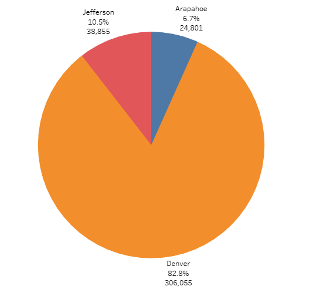

# Python-Based Financial and Election Analyses: A Case Study

## Resources
- Data sources: budget_data.csv, election_results.csv
- Software: Python 3.9.7, Visual Studio Code 1.76.1

## Project Overview
### PyBank
**Use the budget data provided to analyze the financial records of a company.**

The task is to create a Python script that analyzes the records and:
1. Calculates the total number of months included in the dataset
2. Calculates the net total amount of "Profit/Losses" over the entire period
3. Calculates the changes in "Profit/Losses" over the entire period, and then the average of those changes
4. Calculates the greatest increase in profits (date and amount) over the entire period
5. Calculates the greatest decrease in profits (date and amount) over the entire period
6. Exports the results to a text file in the analysis folder

### PyPoll
**Use the election results provided to complete the audit of a recent local congressional election.**

The task is to create a Python script that analyzes the records and:

1. Calculates the total number of votes cast
2. Retrieves the counties where the votes were collected
3. Calculates the voting results from each county
4. Determines the county with the largest number of votes
5. Retrieves a complete list of candidates who received votes
6. Calculates the total number and percentage of votes each candidate received
7. Determines the winner of the election based on the amount of votes received
8. Exports the results to a text file in the analysis folder

## Results & Analysis
### PyBank

- There were 86 total months included in the dataset
- The net total amount was $22,564,198
- The average change on a month-to-month basis was $-8,311.11
- The greatest increase in profits was $1,862,002 which occurred in August 2016
- The greatest decrease in profits was $-1,825,558 which occurred in February 2014

### PyPoll

***The pie charts were created using Tableau.***

- There were 369,711 total votes cast in the election.
- The counties where the votes were collected were:
    - Jefferson County
    - Denver County
    - Arapahoe County
- The results for each county:
    - Jefferson County accounted for 38,855 votes which was 10.5% of the total votes.
    - Denver County accounted for 306,055 votes which was 82.8% of the total votes.
    - Arapahoe County accounted for 24,801 votes which was 6.7% of the total votes.
- The county with the largest number of votes was:
    - Denver County with 306,055 votes or 82.8% of the total votes.
- The candidates were:
    - Charles Casper Stockham
    - Diana DeGette
    - Raymon Anthony Doane
- The candidate results:
    - Charles Casper Stockham received 85,213 votes which was 23.0% of the total votes.
    - Diana DeGette received 272,892 votes which was 73.8% of the total votes.
    - Raymon Anthony Doane received 11,606 votes which was 3.1% of the total votes.
- Based on the candidate results above, the winner of the election is:
    - Diana DeGette, who received 272,892 votes or 73.8% of the total votes.

## Drawing Insights

### PyBank
This script can be used to analyze any financial data. It was able to determine on its own how many months there were, calculate the net total amount, the average change, the greatest increase in profit and corresponding month, and the greatest decrease in profit and corresponding month. Some modifications that can be made to the script are:
- Generalize the column names. Rather than assuming the financial data always comes in a specific format, make the script flexible to handle column names that might differ.
- Allow for multiple data sources. Instead of assuming the data comes from a single .csv file, allow the user to input multiple files or connect to a database.
- Add error handling. To prevent the script from breaking if the data is not in the expected format or if there are any other errors, include error handling and provide helpful error messages to the user.

### PyPoll
This script can be used to analyze any election. It was able to determine on its own how many different candidates and counties were in the results. It also tallied the votes for each candidate, determined the winning candidate from the total votes, and found which county had the most effect on the outcome of the election. Some modifications that can be made to the script are:
- To implement additional security measures to ensure the integrity of the data. For example, we can add a feature that checks for any irregularities or anomalies in the data, such as duplicate or missing votes, and alerts the administrator if any issues are found. 
- We also have the possibility of breaking down the data even more. With this we can display the voter's political views, gender, ethnicity and race, and age for example.
---
View the Project on [GitHub](https://github.com/kenlo94/financial_election_analysis)
